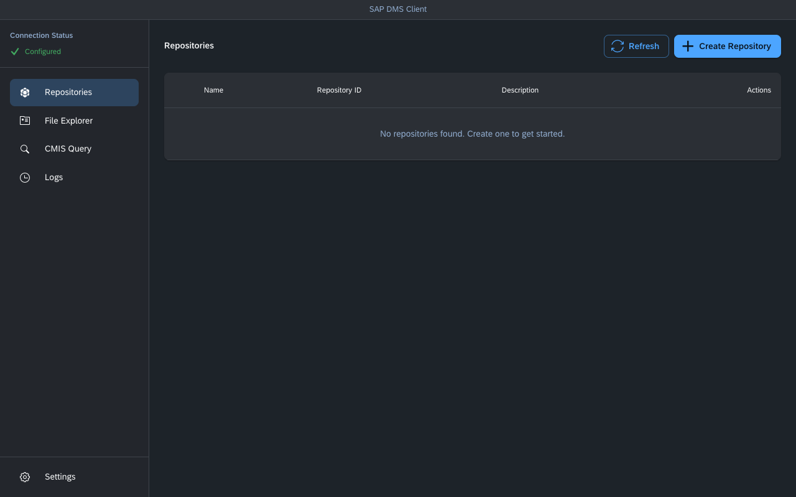
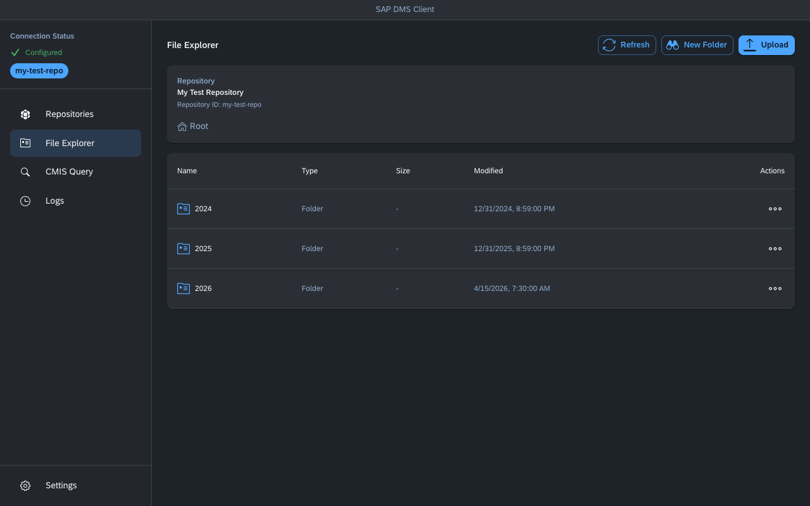
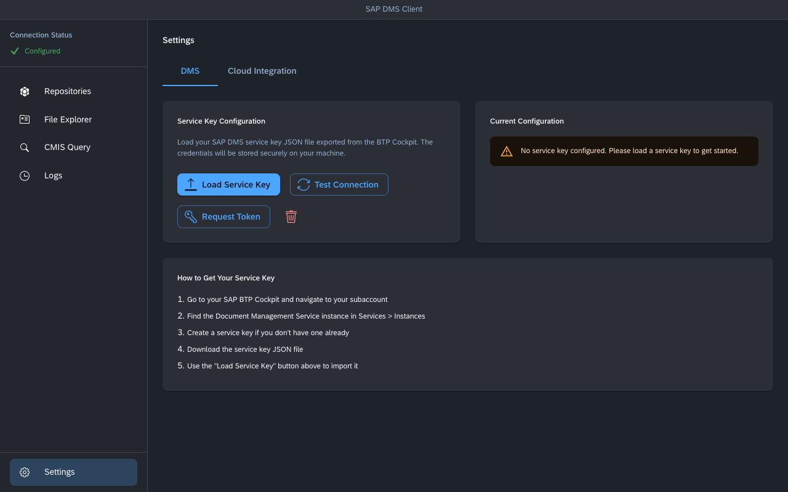

# SAP DMS Client

A cross-platform desktop application for managing documents in SAP Document Management Service (DMS) via the CMIS API, with SAP Cloud Integration (CPI) archiving support.

Built with Electron, React, and Material-UI using the SAP Horizon dark theme.



## Features

- **Repository Management** — Create, list, delete, and browse DMS repositories. Export repository destination config for CPI integration.
- **File Explorer** — Browse, upload, download, rename, and delete documents and folders with breadcrumb navigation.
- **CMIS Query Editor** — Execute custom CMIS queries with pre-built examples and tabular results.
- **CPI Archiving** — Connect to SAP Cloud Integration and activate data archiving configuration.
- **API Logs** — Real-time request/response logging with search, color-coded status, and timing info.
- **Secure Credentials** — Service keys stored locally with OS keychain encryption via Electron's safeStorage API.

<details>
<summary>More screenshots</summary>

### File Explorer


### Settings


</details>

## Prerequisites

- [Node.js](https://nodejs.org/) >= 18
- An SAP BTP subaccount with a Document Management Service instance
- A DMS service key (JSON) exported from the BTP Cockpit

## Getting Started

```bash
# Install dependencies
npm install

# Run in development mode (hot reload)
npm run electron:dev
```

Then go to **Settings**, click **Load Service Key**, and import your DMS service key JSON file.

## Scripts

| Command | Description |
|---|---|
| `npm run dev` | Start Vite dev server only (no Electron) |
| `npm run electron:dev` | Start Vite + Electron with hot reload |
| `npm run electron:preview` | Build frontend and launch in Electron |
| `npm run electron:build` | Production build (Vite + Electron Builder) |
| `npm run build` | Build frontend to `dist/` |

## Building for Distribution

```bash
npm run electron:build
```

Outputs platform-specific installers to `dist-electron/`:

| Platform | Format |
|---|---|
| macOS | `.dmg` |
| Windows | `.exe` (NSIS) |
| Linux | `.AppImage` |

Automated builds run via GitHub Actions on version tag pushes (`v*`).

## Project Structure

```
src/
├── components/        # React UI components
│   ├── FileExplorer/  # Document browser with upload/download
│   ├── Repository/    # Repository management
│   ├── QueryEditor/   # CMIS query interface
│   ├── Logs/          # Activity log viewer
│   ├── Settings/      # Auth configuration (DMS & CPI tabs)
│   ├── Sidebar/       # Navigation drawer
│   └── Layout/        # Main layout wrapper
├── context/           # AppContext (centralized state via React Context + Reducer)
├── services/          # API clients (DMS, auth, CPI auth)
└── styles/            # SAP Horizon theme and fonts

electron/
├── main.js            # Main process — window, IPC handlers, HTTP requests
└── preload.js         # Context bridge for secure renderer ↔ main communication

resources/
└── icon.png           # Application icon
```

## Tech Stack

- **Desktop:** Electron 28
- **Frontend:** React 18, Material-UI 5, Emotion
- **Build:** Vite 5, Electron Builder
- **HTTP:** Axios 1.6.7+ (patched against CVE-2023-45857)
- **Design:** SAP Horizon dark theme with 72 font family

## Documentation

- [How to Create a Repository](docs/how-to-create-repository.md) — Setup guide covering BTP prerequisites, repository creation, and CPI configuration

## License

MIT
